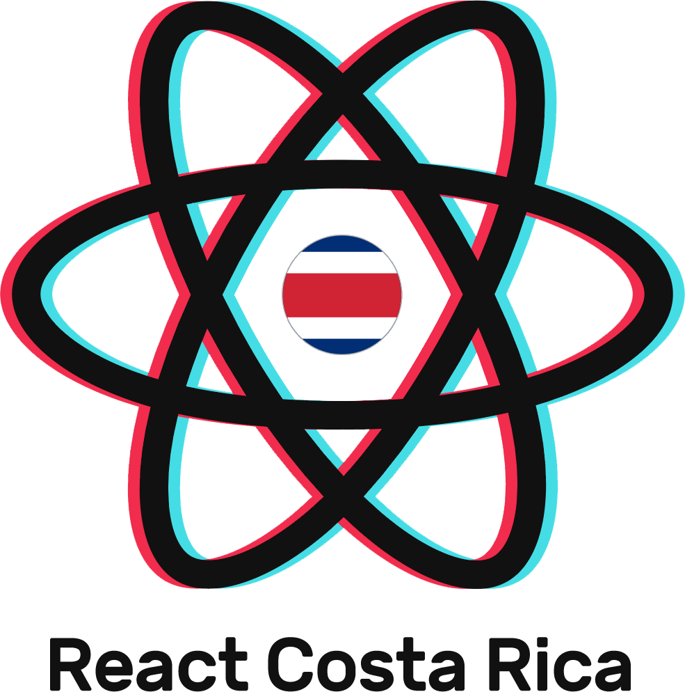

  

  
  
  

  
  

## Getting started

1. Clone this repo
2. Run `yarn dev`

## Contributing guidelines

1. Pick any [issue](./issues) or [create one](./issues/new)
2. Create a new topic branch off of `main`
3. Work on a feature proposal or bugfix and commit your changes
4. Create a PR to `main` with a descriptive title about what you did
5. You rock! 💖

## Contributors

<!-- ALL-CONTRIBUTORS-LIST:START - Do not remove or modify this section -->
<!-- prettier-ignore -->
<table>
  <tr>
    <td align="center"><a href="https://arturocampos.dev"> <b>Arturo Campos</b></a> <a href="https://github.com/reactcostarica/website/commits?author=arturocr" title="Code">💻</a> <a href="#content-arturocr" title="Content">🖋</a> <a href="https://github.com/reactcostarica/website/commits?author=arturocr" title="Documentation">📖</a> <a href="#ideas-arturocr" title="Ideas, Planning, & Feedback">🤔</a> <a href="#infra-arturocr" title="Infrastructure (Hosting, Build-Tools, etc)">🚇</a></td>
  </tr>
</table>
<!-- ALL-CONTRIBUTORS-LIST:END -->

## License

[MIT](./license)
